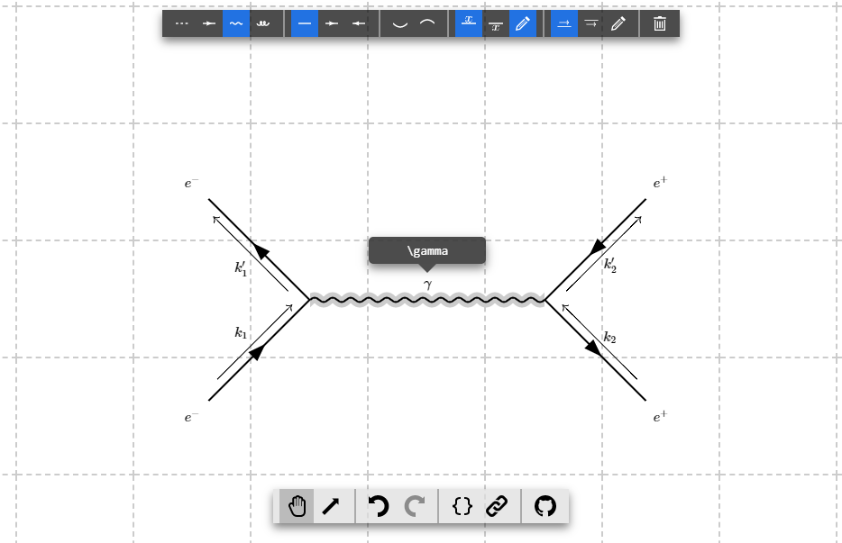

# tikz-feynman-editor

A simple visual editor for creating Feynman diagrams.

You can [try it out here](https://feynman.srossd.com/).



## Building

Make sure you have [Node.js](https://nodejs.org/) and npm installed. First,
clone this repository:

```
$ git clone https://github.com/srossd/tikz-feynman-editor
$ cd tikz-feynman-editor
```

Install dependencies with npm:

```
$ npm install
```

You can build by using the `build` command:

```
$ npm run build
```

This will create a minified bundle `bundle.js` and its source map. To launch,
simply open `index.html` in your favorite modern browser.

Use the `watch` command for development:

```
$ npm run watch
```

To create a self-contained archive file ready for distribution, run the
following command:

```
$ npm run dist
```

This will create a folder and a `zip` file in the `dist` folder.

## Contributing

Bug reports and pull requests are always welcome! Please consult the
[issues list](https://github.com/srossd/tikz-feynman-editor/issues) for existing
issues beforehand.

## Related

- [tikzcd-editor](https://github.com/yishn/tikzcd-editor) - The inspiration for
  this tool, an editor for commutative diagrams
